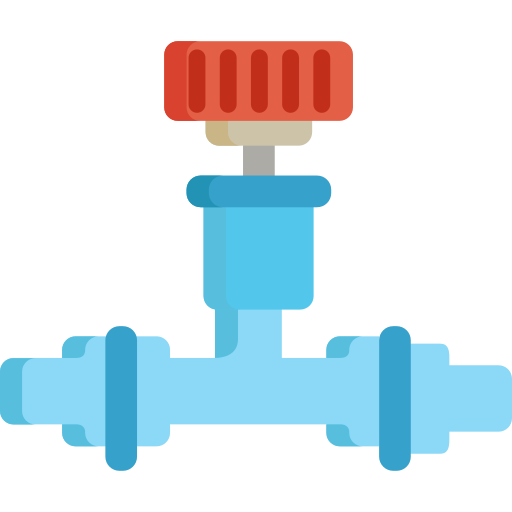
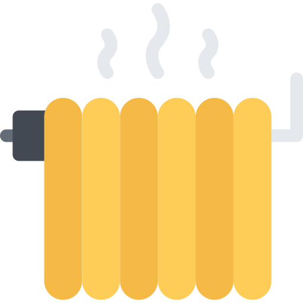

# Summary of hardware

| Function | Type | Breakout || Hardware ||
 ----- | ---- | ----- | - | ----- | - |
 Deliver fluids | Actuator | Solenoid breakout |  | Solenoid | 
 Deliver fluids | Actuator | Stepper/DC driver |  | Peristaltic pump | 
 Control temperature | Actuator | H-Bridge |  | Peltier element | 
 Control temperature | Sensor | Thermometer breakout |  | Thermometer | 
 Indicate / illuminate | Actuator | 8-channel switch array | | LED | 
 Move precisely | Actuator | Stepper/DC driver |  | Stepper motor | 
 Move fast | Actuator | Stepper/DC driver |  | DC motor | 

!!! tip
    Something useful.