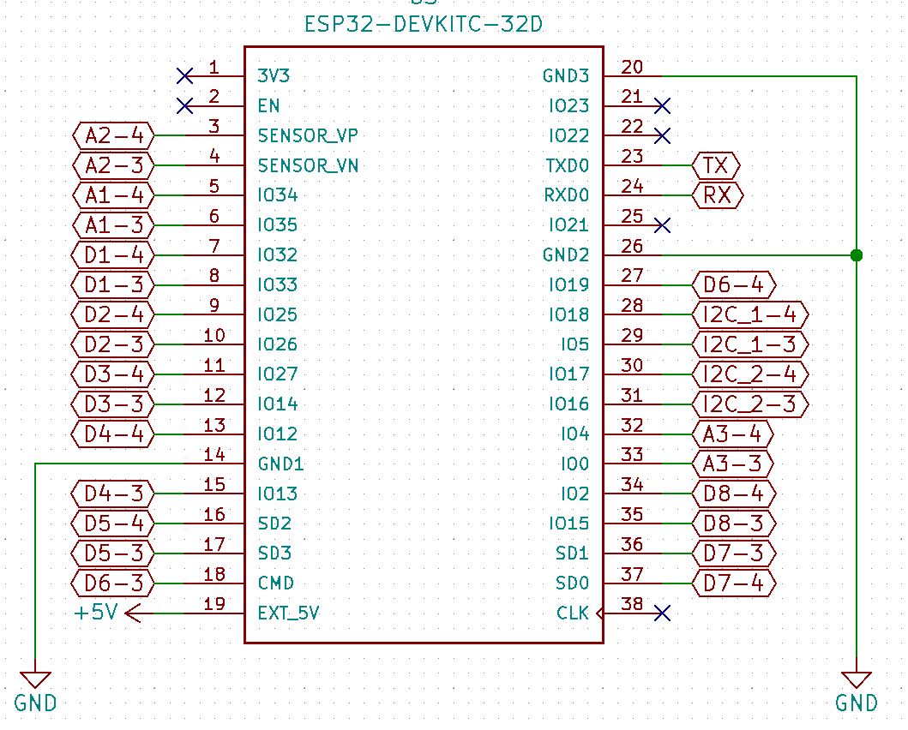

In this folder users & collaborators will find designs and considerations about the hardware parts being developed in this project. 

### hub_PCB:
- the central part of the system, is mainly a breakout board for the ESP32 being used and two built in power supplies. 

The pin mapping of the ESP32 controller and our board can be seen here:

Using table 2 of this [manual](https://www.espressif.com/sites/default/files/documentation/esp32-wroom-32_datasheet_en.pdf) we can see all the options for each pin.